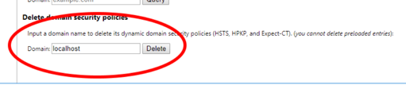

OpenTable front-end coding challenge
====================================

Thank you for accepting our coding challenge. Please take as much time as required to give us a good indication of your coding strengths, as your application will provide many topics of conversation in the next interview stage.

## The task

We would like you to build a web application.
- The application will allow one user to select dishes on behalf of two diners.
- The application will present a menu that will be provided and may later require adjustment by a restaurant.
- The application will enforce some restrictions provided by the restaurant. (see [#rules](#rules))

We've prepared a simple data file which contains an example menu with prices to help get you started. This can be found under
`server/menu-data.json`. Please see the [#Server](#server) section for more details.

Please write as clean and maintainable code as possible, and make sure that it's covered by test cases.

## Technology Requirements
* Please do not use class based react components. Use hooks and other modern features as necessary
* If global state management is needed, Redux is preferred
* Correct use of semantic HTML and accessibility is encouraged
* Feel free to use modern browser APIs
* Please refrain from using 3rd party component and styling libraries
* Use the Fetch API for data transfer between client and server
* Feel free to use scss, styled-components, etc.
* Feel free to install any linting and code style tools
* Use Node version 12.*

## Rules

_To recap, you will build an interface that allows a user to select dishes for a fixed party of **two diners**._
This restaurant unfortunately has a number of rules about the meals that can be ordered.

- Each person must have at least two courses, one of which must be a main.
- Each diner cannot have more than one of the same course.
- There is only one piece of cheesecake left.
- Pierre the snobby waiter will not let you have prawn cocktail and salmon fillet in the same meal.

## Acceptance criteria

- The total bill amount is displayed when at least one dish has been selected.
- An error message is displayed when I try to select an invalid menu combination.

## Submission

Please submit your program either by sending a zip file or by providing a link to a repository, dropbox, etc to your point of contact at OpenTable.

## Server
server runs on port 5050

The menu data is served at this endpoint:
* GET `http://0.0.0.0:5050/api/menu`

You shouldn't need to modify any of the server code.

## Client
client runs on 3001 and proxies requests to server on port 5050

## To Run
npm i

npm run build

npm run start

The app should launch on http://localhost:3000 -- sometimes chrome will redirect you to `https` so beware of that. If you're having trouble with chrome
redirecting you, see the section below for how to fix that.

## Troubleshooting

Chrome can be a little annoying about local development.

If chrome is blocking you from running locally due to ssl:
* paste this into the url: `chrome://flags/#allow-insecure-localhost`
* Enable the toggle for this setting

If chrome is redirecting your app to https:
* then go to`chrome://net-internals/#hsts`
* Scroll to the bottom and delete the security policy for `localhost`:
  
  
  
## Backup Environment

If the candidate is having trouble getting the project running due to local issue codesandbox can be used as a backup option:
https://codesandbox.io/s/menu-code-test-ts-csio-579gno

1. Paste the menu-data.json into `src/server/menu-data.js`
2. Copy/paste the readme into the project.
3. Data is now served on `/menu`, not `http:0.0.0.0:5050/api/menu`;

